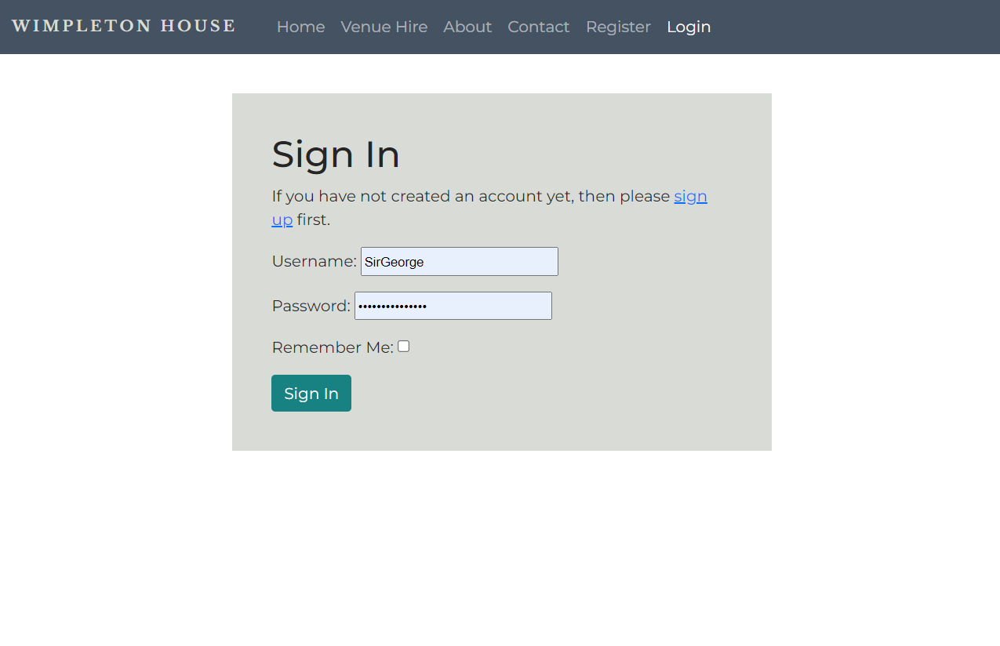

# Wimpleton House Booking Application
  

  [View Live Project Here](https://wimpleton-booking-edd90b3067af.herokuapp.com/)

## Introduction
Wimpleton House Booking website is a full-stack web application created with HTML, CSS, JS, Python, the Django web framework and the Bootstrap library. This website application allows users to view a fictional Irish country estate that hires out it's buildings and grounds for special events. Visitors to the website are able to view the different venue hire options. Upon registering as a user of the website and logging in, users are then able to request to book a particular venue option for a specific date. This booking request reserves the chosen venue for the chosen date and prevents another user from booking the same venue for the same date. Users have access to a Booking Dashboard which allows them to view and manage their bookings.

## CONTENTS  
  
* [User Experience](#user-experience)
  * [User Stories](#user-stories) 
* [Data Model](#data-model)
  * [Design](#design)
  * [Flowchart](#flowchart)
* [Features](#features)
  * 
* [Future Features](#future-features)
* [Technologies](#technologies)
  * [Languages Used](#languages-used)
  * [Technologies and Programs Used](#technologies-and-programs-used)
  * [Deployment](#deployment)
* [Testing](#testing)
  * [Python3 Validation](#python3-validation)
  * [Manual Testing](#manual-testing)
  * [Bugs and Fixes](#bugs-and-fixes)
  * [Unfixed Bugs](#unfixed-bugs)
* [Credits](#credits) 

  
---   

## User Experience
The goal of the Wimpleton House Booking website is to provide a business tool that allows the business to engage meaningfully with potential clients. The website offers information about the different Venue hire options for the estate and then allows visitors to register as users and create, view, edit, and delete booking requests with the estate.

Although some events may be one-off events like a wedding, the estate has a goal of creating ongoing relationships with event planners, businesses, corporations, and communities for events that potentially could be annual, bi-annual, quarterly, or even more frequent and facilitates clients managing their bookings and review past booking records.
- ### Visitor Goal
  As a user, I want to easily view potential venue hire options at the Wimpleton House estate, to create a booking, and to view and manage all my bookings.
- ### User Stories
  1. As a vistor, I can access the main, public pages and navigate easily through the website.
  2. As a visitor, I can easily review the venue hire options available at the Wimpleton house.
  3. As a visitor, I can easily register as a user to the website.
  4. As a user, I can log into the website to access my account.
  5. As a user, I can see that I am logged into the website on the navbar.
  6. As a user, I can easily access the Booking Dashboard and view my current and expired bookings.
  7. As a user, I can easily book a specific venue for a specific date either via the Booking dashboard or directly from the Venue Hire page.
  8. As a logged in user, I can securely end by session by logging out.
  9. As a visitor, I can see customized error pages for 404 and 500 errors so that I can understand what happened and take the appropriate action.

- ### Site Admin Stories
  1. As a site owner/administrator, I can create a user account for a client.
  2. As a site owner/administrator, I can create, read, update, and delete Venue options and descriptions.
  3. As a site owner/administrator, I can create, read, update, and delete Bookings for clients.
  4. As a site owner/administrator, I can read, update, and delete existing Bookings for a client.
  5. As a site owner/administrator, I can approve a booking, which in theory, initializes the next step for the client for the booking (i.e. initialises an event consultation, contract creation, and deposit payment).
  6. As a site owner/administrator, I can view messages sent through the email contact form via the website.

## Agile Methodology
The Agile Methodology was the project management approach used for this project. I attempted to break the project into phases and followed a cycle of planning, executing, and evaluating.
### Kanban Board 
  Something about kanban boards

### UI Design
  I created some rough wireframes when first planning the website. I had three basic variations with consideration to reponsive design for the mobile, tablet, and desktop layouts.

  

  
Design Mockups
  

  
  

## Features
### Navbar - top navigation
The navbar incorporates the logo and a responsive navbar that collapses to a hamburger when a device is less than a tablet. The navigation options provide the user with all of their potential navigation options including registering as a user or logging into the user dashboard to create and/or manage bookings.

Public navbar
  

Registered user navbar (logged in)

 

### Home Page
The Home page provides a featured image of Wimpleton House as well as brief details about the venue hire opportunities at the Wimpleton.

Home Page - Featured Image

Home Page - Venue Hire short descriptions

### Venue Hire Page
The Venue Hire page features details about each of the venue hire options available at the Wimpleton Hosue. A visitor also can click on a button that directs them to the Booking form if they are logged in or to the sign in page if they are not already signed in or registered as a user. There are additional buttons at the end of each venue description that once clicked directs the user to the Booking form with that particular venue preselected in the booking form. Each of the venue images and descriptions are generated dynamically from the venues saved in the database.

Venue Hire page

Venue Hire - Venue Descriptions

### About Page
The About page provides basic information about Wimpleton House and emphasises it's versatility as a venue for hire for special events. Following the Wimpleton House details, there is a gallery that features images of various special events that were hosted previously at the Wimpleton House.

About page

### Contact Page
The Contact page features basic contact information for the Wimplton House including address and telephone details. The page also includes a google maps embedded into the page. The Contact page also features a email contact form that allows the vistor to ask questions or to send a message to the Wimpleton House staff by completing the form. The information is stored in the database and the messages accessible to staff members via the Admin panel.

Contact Page

### Booking Dashboard
The Booking Dashboard is the hub for the user to create, manage, and delete bookings. The Booking Dashboard displays bookings dependent on their status (e.g. Approved, Pending approval, and Expired). The dashboard also features a button that direct the user to the Request Booking form. Once the user has created a booking request, the booking will be displayed in the dashboard in the appropriate section. The user should then be able edit or delete any active bookings with the status of Approved or Pending. Expired bookings are not editable by the user although they can be edited by an admin via the Admin panel.

Booking Dashboard

### Request Booking Form
This page allows the user to input the details of the venue they'd like to book. Users are requested to choose a venue (based on the a selection based on the approved Venues saved in the database), an event type (via preset choices), number of guests (a minumum of 20 guests and maximum of 500 guests), and the event date (only dates from 5 days in advance of the current date to two years out are accepted). The form validates the data and prints an error message corresponding with each field input box if the user inputs something that is not in line with the predetermined paramenters. A successful submission removes the venue with that particular event date from future bookings and returns the user to the Booking dashboard where they can see a success message.

Request Booking Form

Request Booking Error Messages Example

Request Booking Success Example

### Edit Booking Page
The Edit booking page is an option for any current and existing booking for that user. Expired bookings (in the past) are not editable by the user. The user is able to edit any of the booking details such as venue, event type, event date, and number of guests as long as they make changes that stay within the form's criteria. For example, if the user attempts to rebook the venue to a date that's already book, the user will not be allowed to change the booking.

Edit Booking page

Edit Booking success message

### Delete Booking
A user can only delete bookings that both exist and are current. Expired bookings are not deletable by the user. When the user clicks on the delete button, a modal will open and the user must confirm that they wish to delete the booking or they are given the option to cancel the request. Once the user confirms, they are then redirected back to the Booking dashboard and will see a confirmation that they deleted their booking.

Delete Booking

Delete Booking Confirmation

### Sign In Page
A user is prompted to sign in when they attempt to make a booking.

Sign in Page

### Sign Out Page
The user can sign out at any point.

Sign Out Page

### Register Page
If the user wishes to make a booking and clicks on any of the booking buttons, they will be directed a register page where they can register or log in if they have already registered.

Register Page

### Footer
The footer contains links to the Venue Hire page, the About page, the Contact Page and the Home Page. It also contains two social media links to Facebook and Instagram. The Copyright information is also on the footer.

Footer

### 404 Error Page
If the user attempts to navigate to a non-existing page, the 404 Error page will display.

404 Error Page

### 500 Error Page
If there is a server error, a 500 Error page will display.

500 Error Page

### Future Development
- I think the error handling on the Edit Booking page could be better. I didn't realise until late in the testing phase that the form doesn't validate changes to the date and number of guests the same way it does for the Request Booking form. I changed the error message so that it works for current form but it doesn't give the user enough information about the specific problem. I didn't have enough time to figure out a better solution before this project concluded. In a future version, I would like to resolve this and provide better error messaging.
- I had hoped to delve deeper into unit testing and if time allowed, develop more comprehensive unit testing in the future.

## Technologies
  ### Languages and Libraries Used
  - HTML, CSS, Javascript, Python, Django Web Framework, and Bootstrap Library
  - Django Crispy Forms, Django Summernote
  - Gunicorn 
  - Whitenoise - allows web app to serve static files

  ### Technologies and Programs Used
  - GitHub - used to save and store all the files for this website
  - GitPod and VSCode - was used as the IDE to develop and test the code for this website in both the cloud and locally.
  - Git - provided the version control
  - Heroku - provided the cloud deployment environment shell and Command Line Interface (CLI)
  - Cloudinary - Use for cloud storage of media files uploaded by the user
  - draw.io - used for flowchart creation
  - W3C HTML validator
  - W3C Jigsaw
  - Jshint Linter
  - Code Institute PEP8 Python Linter

  ### Deployment
  GitHub and Heroku was used to deploy this website using the Gitpod Code Institute template which preloads any required dependencies. The following steps were taken:

  
  1. Log into GitHub account. 
  2. Navigate to the project repository: [Wimpleton]((https://github.com/hysinh/wimpleton-booking-app)
  3. Navigate to the CODE link on the navigation across the top.
  3. Then, navigate to the green CODE button on the right side and click.
  4. Select the Local tab and click on the copy icon to make a copy of the repository.
  5. Log into Heroku.com account.
  6. Navigate to the "New" button on the top right.
  7. Click on "New" and then click on "Create a new app".
  8. On the next page, create a unique App name for your deployment and choose a region. Then, click on the "Create app" button.
  9. Once your app has been created, it directs you to a new screen.
  10. Navigate across the top of the screen and click on the "Settings" tab.
  11. Navigate down the page and click on the "Reveal Config Vars" button.
  12. For the first key, type in "CLOUDINARY_URL" and then copy and paste the entirety of your cloudinary url file into the value box.
  13. For the second key, type in "DATABASE_URL" and then type in your unique Postgres database url in its corresponding value.
  14. Then in the third key, type in "SECRET_KEY" and your secret key in to the corresponding value.
  15. Under Buildpacks, add the <b>python</b> buildpack. 
  16. After this is complete, navigate to the Deploy tab from the menu across the top of the page. Click on "GitHub" under Deployment method and provide the required access when prompted.
  17. Choose Automatic or Manual deployment.
  18. Click "Deploy" when ready to deploy.

  #### How to clone the Wimpleton House Booking App & make changes:
  1. Open the [Wimpleton-House-Booking-App repository](https://github.com/hysinh/wimpleton-booking-app) on GitHub.
  2. Navigate to the CODE link on the navigation across the top.
  3. Then, navigate to the green CODE button on the right side and click.
  4. Select the Local tab and click on the copy icon to make a copy of the repository.
  5. Then navigate back to your main GitHub dashboard and then create a new repository with your desired name.
  6. On the next page, navigate to the bottom of the page and select Import code under "Import code from another repository".
  7. In the next window, paste the copied link of the [Wimpleton](https://github.com/hysinh/wimpleton-booking-app) into the line.
  8. Then, click Begin Import to import the repository code.
  9. Make changes and/or deploy as desired.
  10. This program requires the use of a postgres database, the Django Webframe work, Bootstrap CSS library, Django Crispy Forms, Gunicorn, Django Summernote and a Cloudinary account.

  ## Testing
  Please view all the testing documentation in [TESTING.md](TESTING.md)

  
## Credits
### Code
- Sandeep Aggarwal, my Code Institute Mentor, helped me write the maximum attribute for the code for my DateInput function.
- Jason Holt Smith helped me write the code in my Form Unit tests for the Venue which is a foreign key to my Booking model.
- I reused the delete modal used in in the Code Institute Django Blog walk through project
### Content
- #### Images - [Pexels](https://www.pexels.com/) was my primary image source
  - 
- Getting a json file output of object
  https://sentry.io/answers/creating-a-json-response-using-django-and-python/
- Comparing dates - strings vs objects
  https://stackoverflow.com/questions/15311222/comparing-dates-stored-as-strings-in-django
- Accessing django properties
  https://dev.to/doridoro/django-model-properties-28ac
- How to compare dates in django
  https://stackoverflow.com/questions/3798812/how-to-compare-dates-in-django-templates
- 404 custom and 500 pages with handler url
  https://stackoverflow.com/questions/20581017/django-custom-404-page-not-working

