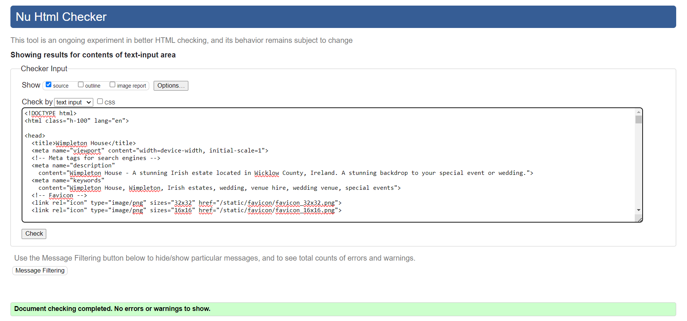
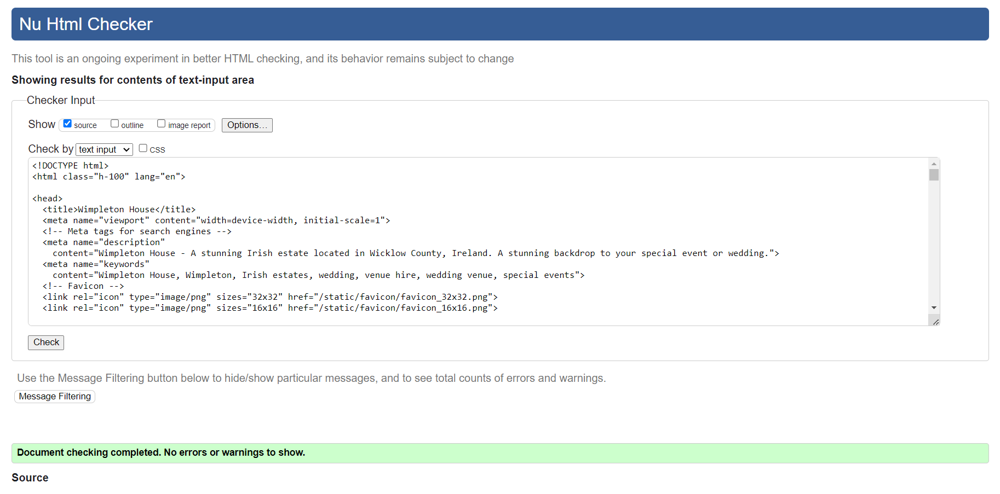
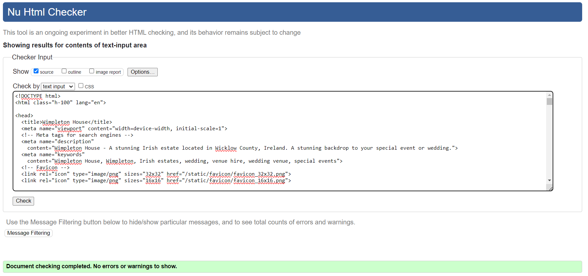

# Wimpleton House Booking Application
  Back to [README](https://github.com/hysinh/wimpleton-booking-app/blob/main/README.md)

## Testing Overview
## CONTENTS  
  
* [User Story Testing](#user-experience)
* [Validator Testing](#validator-testing)
  * [HTML](#html)
  * [CSS](#css)
  * [Javascript](#javascript)
  * [Python](#python)
* [Unit Testing](#unit-testing)
* [Error Handling](#error-handling)
* [Manual Testing](#manual-testing)
  * [Input Validation](#input-validation)
  * [Add Mortgages](#add-mortgages)
  * [View Mortgages](#view-mortgages)
  * [Compare Mortgages](#compare-mortgages)  
  * [Overpayments](#overpayments)
  * [Amortization Schedule](#amortization-schedule)
  * [Mortgage Data Analysis](#mortgage-data-analysis)
  * [Exit Program](#exit-program)
* [Future Features](#future-features)
* [Technologies](#technologies)
  * [Languages Used](#languages-used)
  * [Technologies and Programs Used](#technologies-and-programs-used)
  * [Deployment](#deployment)
* [Testing](#testing)
  * [Python3 Validation](#python3-validation)
  * [Manual Testing](#manual-testing)
  * [Bugs and Fixes](#bugs-and-fixes)
  * [Unfixed Bugs](#unfixed-bugs)
* [Credits](#credits) 

  
---   

## Testing
### Validator Testing
This application was developed with HTML, CSS, Javascript, and Python using the Django Web Framework.
  - #### HTML Validation
    The [W3C HTML validator](https://validator.w3.org/) was used for the HTML validation.
    #### Public Pages
    

    
Home page (base.html and index.html)
  

    
    

    

    
Venue Hire page (venue_hire.html)
  

    
    

    

    
About page (about.html)
  

    
    

    

    
Contact page (contact.html)
  

    
    

    #### Registered User Pages (Logged in)
    

    
Booking Dashboard page (booking_dashboard.html)
  

    
    

    

    
Request Booking page (request_booking.html)
  

    
    

    

    
Edit Booking page (edit_booking.html)
  

    
    

    

    
Delete Booking page (delete_booking.html)
  

    
    

    #### Custom Error Pages
    

    
404 Error Page (404.html)
  

    
    

    

    
500 Error page (500.html)
  

    
    

    
  - #### Python3 Validation
    I used the Code Institute PEP8 Python Linter for code validation.
    

    
Python Validation
  

    
    

  - #### Python3 Validation
    I used the Code Institute PEP8 Python Linter for code validation.
    

    
Python Validation
  

    
    

  - #### Python3 Validation
    I used the Code Institute PEP8 Python Linter for code validation.
    

    
Python Validation
  

    
    

  ### Manual Testing
  Manual testing was performed on the website checking for print errors, content errors, and any errors in the flow of the application or in it's calculations.

  #### Browsers
  1. Microsoft Edge
  2. Google Chrome
  3. Opera

  #### The results of testing are as follows:
  | Page | Test | Pass/Fail |
  | ---- | ---- | --------- |
  | Intro/Logo  | Does the Logo page load and allow the user to progress to the Main Menu? | Pass |
  | Main Menu  | Does the Main menu display correctly | Pass |
  | Main Menu  | Is the input validation for the Main Menu working correctly? | Pass |
  | Main Menu  | If the user selects an option from the Main Menu, does it direct the user to that option correctly? | Pass |
  | Add Mortgage  | On the Add Mortgage page, does it allow the user to create a Mortgage profile? | Pass |
  | Add Mortgage  | Is the input validation on the Add Mortgage page working? | Pass |
  | Add Mortgage  | Is a Mortgage profile added correctly if the user selects this option? | Pass |
  | Add Mortgage  | Is the Google Sheet updated with the data of the new Mortgage profile created regardless of whether the Mortgage profile is saved for the session? | Pass |
  | Add Mortgage  | Once Add Mortgage options are completed, is the user directed back to the Main Menu options? | Pass |
  | View Mortgage  | Does the page display an error message if there are no saved Mortgage profiles and directed back to the Main Menu? | Pass |
  | View Mortgage  | Does the page display all of the saved Mortgage Profiles and their name to the user? | Pass |
  | View Mortgage  | Is the user able to select a Mortgage Profile to view? | Pass |
  | View Mortgage  | Does an error message display if the user enters an invalid Mortgage option? | Pass |
  | View Mortgage  | Does the page display all of the saved Mortgage Profiles and their name to the user? | Pass |
  | View Mortgage  | When the user enters a valid Mortgage option, is the Mortgage profile displayed on the terminal? | Pass |
  | View Mortgage  | Is the user able to view another Mortgage and is given the option to exit this page and return to Main Menu? | Pass |
  | Compare Mortgages  | Does the page display an error message if there are less than 2 Mortgage profiles saved and directed back to the Main Menu? | Pass |
  | Compare Mortgages  | Does the page display all of the saved Mortgage Profiles and their name to the user? | Pass |
  | Compare Mortgages  | If there are 2 or more saved Mortgage profiles saved, does a comparison table print to the terminal? | Pass |
  | Compare Mortgages  | Is the user directed back to the Main Menu after the comparison table display is completed? | Pass |
  | Overpayments  | Is the user given an option to explore Extra Monthly Principal payments or Lump Principal Payments? | Pass |
  | Overpayments  | Is the user given an error message if they choose an invalid option? | Pass |
  | Overpayments  | Is the user able to exit the menu and return to the Main Menu? | Pass |
  | Extra Monthly Principal Overpayments  | Is the user able to enter Mortgage profile with extra monthly principal payments? | Pass |
  | Extra Monthly Principal Overpayments  | Are all user inputs validated with an error message printed? | Pass |
  | Extra Monthly Principal Overpayments  | Once the data is accepted, is the Mortgage profile displayed with an updated Amortization schedule? | Pass |
  | Extra Monthly Principal Overpayments  | Is the user able to save their Mortgage profile if desired? Does a confirmation display | Pass |
  | Extra Monthly Principal Overpayments  | Is the user redirected to the Main menu? | Pass |
  | Extra Lump Overpayments  | Is the user able to enter Mortgage profile with extra monthly principal payments? | Pass |
  | Extra Lump Overpayments | Are all user inputs validated with an error message printed? | Pass |
  | Extra Lump Overpayments | Once the data is accepted, is the Mortgage profile displayed with an updated Amortization schedule? | Pass |
  | Extra Lump Overpayments | Is the user able to save their Mortgage profile if desired? Does a confirmation display| Pass |
  | Extra Lump Overpayments  | Is the user redirected to the Main menu? | Pass |
  | Amortization Schedule  | Does the page display an error message if there are no saved Mortgage profiles and directed back to the Main Menu? | Pass |
  | Amortization Schedule  | Does the page display all of the saved Mortgage Profiles and their name to the user? | Pass |
  | Amortization Schedule  | Is the user able to select a Mortgage Profile to amortize? | Pass |
  | Amortization Schedule  | Does an error message display if the user enters an invalid Mortgage option? | Pass |
  | Amortization Schedule  | Does an amortization schedule print for the selected Mortgage Profile | Pass |
  | Amortization Schedule  | Is the user able to view another Mortgage and is given the option to exit this page and return to Main Menu? | Pass |
  | Exit Program  | Does the terminal clear and an exit message print when this option is selected? | Pass |
  | 0 Menu Option  | Does the terminal clear and the Main menu print with a prompted to input a Menu option? | Pass |

  #### Bugs and Fixes
  | Bug | Page | Fix |
  | --- | ---- | --- |
  | Confirmation message for saved mortgage option not printing to terminal after saving a mortgage | Extra Monthly Principal Payments | Removed code that ends loop to resolve. |
  | Confirmation message for saved mortgage option not printing to terminal after saving a mortgage | Extra Lump Principal Payments | Removed code that ends loop to resolve. |
  | Unclear for users what to do if Main Menu is no longer visible. | All Pages | Add text above menu prompt that instructs user to enter 0 to go to the Main menu. |
  | Table needs to display Mortgage name rather than Mortgage key | Compare Mortgages | Updates Mortgage class method that generates values for comparison table so that mortgage name displays instead of mortgage ID/key |
  | Table needs to display Mortgage name rather than Mortgage key | Amortization Schedule | Replace print statement with mortgage name variable rather than Mortgage key |
  | Unexpected indentation | Main Menu Prompt| Removes backslash from string |

  
  ### Unfixed Bugs
  - Although I have included a function that clears the terminal, I noticed that anything above the terminal screen does not clear and is still available to view if you scroll up. This is potentially confusing but I was not able to resolve it. My mentor said that it is common for older terminals to push content upward and not truly clear the screen.
  - When viewed through a mobile device, the terminal goes off screen. I will need to research this to see if this is something that is resolvable.
  
  ### Unresolved Linter Code Errors

  | Bug | Line | Unresolved Reason |
  | --- | ---- | --- |
  | Line length | 111 | I tried several different places to attempt to break up the lines to stay <79 but it resulted in poor print outcomes. |
  | Line length | 121 | I tried to delete the extra spaces in the formula but it caused "missing white space around operator" errors. |

  

## Credits
### Content
- ASCII Art https://stackoverflow.com/questions/9632995/how-to-easily-print-ascii-art-text
- https://pypi.org/project/pyfiglet/
- http://www.figlet.org/examples.html
- Clearing the console https://stackoverflow.com/questions/517970/how-can-i-clear-the-interpreter-console
- Input validation
https://www.copahost.com/blog/input-python/#:~:text=For%20example%2C%20if%20you%20want,%22)
- Mortgage calculator formulas https://en.wikipedia.org/wiki/Mortgage_calculator,
- Mortgage calculator https://www.ccpc.ie/consumers/money-tools/extra-mortgage-payments-calculator/
- Mortgage calculator https://www.ccpc.ie/consumers/money-tools/mortgage-calculator/
- https://automatetheboringstuff.com/2e/chapter8/
- Python dictionaries https://www.codecademy.com/learn/dscp-python-fundamentals/modules/dscp-python-dictionaries/cheatsheet
- Python dictionaries https://www.freecodecamp.org/news/add-to-dict-in-python/
- Python dictionaries https://www.w3schools.com/python/python_dictionaries_nested.asp
- Python dictionaries https://www.digitalocean.com/community/tutorials/python-add-to-dictionary
- Tabulate https://pypi.org/project/tabulate/
- Amoritization https://www.investopedia.com/terms/a/amortization.asp
- Amoritization https://discuss.python.org/t/calculation-of-mortgage-amortization/20687/3
- Amoritization https://sidhanthk9.medium.com/how-to-code-an-amortization-schedule-in-python-e2d2b417c61a
- Color https://pypi.org/project/termcolor/
https://sparkbyexamples.com/pandas/print-pandas-dataframe-without-index/#:~:text=Use%20hide_index(),Python%203.7%20or%20the%20latest.
- https://stackoverflow.com/questions/517970/how-can-i-clear-the-interpreter-console
- https://www.geeksforgeeks.org/clear-screen-python/
- W3Schools Python https://www.w3schools.com/python
- https://www.python.org/
