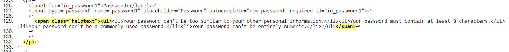
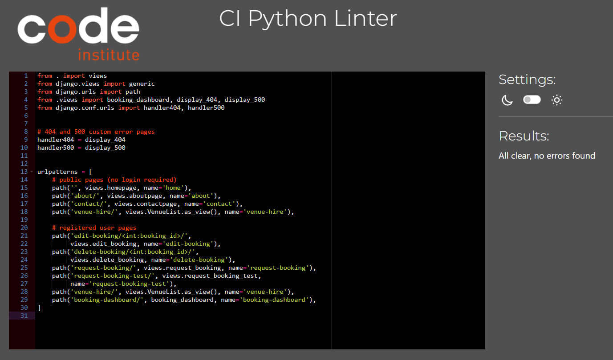
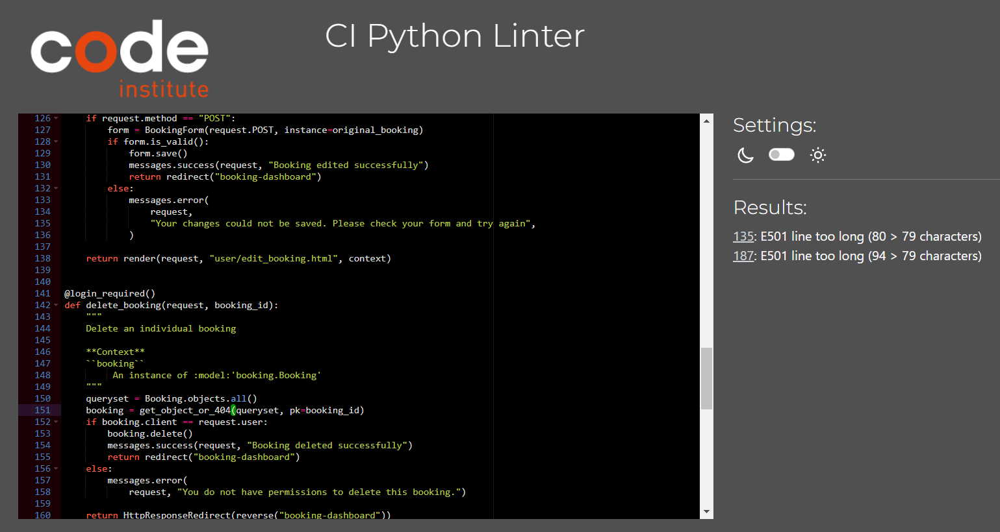

# Wimpleton House Booking Application
  Back to [README](https://github.com/hysinh/wimpleton-booking-app/blob/main/README.md)

## Testing Overview
## CONTENTS  
  
* [Testing](#testing)
  * [Manual Testing](#manual-testing)
  * [Bugs and Fixes](#bugs-and-fixes)
  * [Unfixed Bugs](#unfixed-bugs)

  
---   

## User Story Testing

## Testing
### Validator Testing
This application was developed with HTML, CSS, Javascript, and Python using the Django Web Framework.
  - #### HTML Validation
    The [W3C HTML validator](https://validator.w3.org/) was used for the HTML validation. I copied the page source of the fully rendered page into the validator for testing.
    #### Public Pages
    

    
Home page (base.html and index.html)
  

    
    

    

    
Venue Hire page (venue_hire.html)
  

    
    

    

    
About page (about.html)
  

    
    

    

    
Contact page (contact.html)
  

    
    

    

    
Register page (signup.html) - ERRORS Detail - See bug in Table
  

    
    

    

    
Register page (signup.html) - ERRORS Detail 2 - See bug in Table
  

    
    

    

    
Login page (signin.html)
  

    
    

    

    #### Registered User Pages (Logged in)
    

    
Booking Dashboard page (booking_dashboard.html)
  

    
    

    

    
Request Booking page (request_booking.html)
  

    
    

    

    
Edit Booking page (edit_booking.html)
  

    
    

    

    
Signout page (signout.html)
  

    
    

    
    #### Custom Error Pages
    

    
404 Error Page (404.html)
  

    
    

    

    
500 Error page (500.html)
  

    
    

    
  - #### CSS Validation
    I used the [W3C Jigsaw](https://jigsaw.w3.org/css-validator/) for CSS validation.
    

    
CSS Validation
  

    
    

  - #### Javascript Validation
    I used the [Jshint Linter](https://jshint.com/) for Javascript code validation.
    

    
Javascript Validation
  

    
    

  - #### Python Validation
    I used the [Code Institute PEP8 Python Linter](https://pep8ci.herokuapp.com/) for code validation. Unresolved bugs are noted in the bug table.
    #### Wimpleton Project
    

urls.py

    
    

    

settings.py

    
    

    #### Booking App
    

urls.py

    
    

    

views.py

    
    

    

models.py

    
    

    

forms.py

    
    

    

admin.py

    
    

    

test_forms.py

    
    

    

test_views.py

    
    

  ### Unit Testing
  I was able to successfully execute unit testing on the booking form and the email contact form. 

  #### Unit Tests Run
  - Forms: Test EmailForm .is_valid()
  - Forms: Test EmailForm if no data
  - Forms: Test BookingForm .is_valid()
  - Forms: Test BookingForm if not data

  

Unit Testing Results

  
  
  

  ### Manual Testing
  Manual testing was performed on the website checking to ensure pages rendered correctly, input forms worked correctly, and a user was able to create, view, edit, and delete their bookings.

  #### Browsers
  1. Microsoft Edge
  2. Google Chrome
  3. Opera

  #### The results of testing are as follows:
  | Page | Test | Pass/Fail |
  | ---- | ---- | --------- |
  | Home page | Does the Home page load correctly? | Yes |
  | Home page (base.html) | Do all the navigation links work? | Yes |
  | Home page (base.html) | Do all the footer links work? | Yes |
  | Home page (base.html) | Is the user able to see a notification in the navbar that they are currently logged in? | Yes |
  | Venue Hire page | Does the Venue Hire page render correctly? | Yes |
  | Venue Hire page | Do all the venues render correctly? | Yes |
  | Venue Hire page | Does the generic booking link take you the booking form page (or Sign in page if not signed in? | Yes |
  | Venue Hire page | Do each of the booking links at the bottom of each venue link correctly to the Booking form page and set the initial value for the venue in the form? | Yes |
  | About page | Does the About page render correctly? | Yes |
  | Contact page | Does the Contact page render correctly? | Yes |
  | Contact page | Does the Contact Email Contact form work correctly? | Yes |
  | Contact page | Does the Contact Email Contact form display error and confirmation messages appropriately? | Yes |
  | Venue Bookings page | Does the Venue Booking page correctly render the Booking Dashboard | Yes |
  | Venue Bookings page | Do approved, pending approval, and expired bookings display in the correct sections? | Yes |
  | Venue Bookings page | Does the Request a booking button work correctly? | Yes |
  | Venue Bookings page | Do the edit and delete bookings buttons work correctly? | Yes |
  | Request Booking page | Does the Request Booking page render correctly? | ? |
  | | Does the Request Booking form work correctly and allow a user to request a booking? | Yes |
  | | Do the form error messages display correctly? | Yes |
  | | Does a successful request redirect correctly to the booking dashboard and display a success message? | Yes |
  | | Does the event date input validated and display the correct error handling? | Yes |
  | | Does the number of guests input validated and display the correct error handling? | Yes |
  | Edit Booking page | Does the Edit booking page render correctly? | Yes |
  | | Does the Edit booking page allow the user to edit a specific existing booking? | Yes |
  | | Is the input validated and display the correct error messages? | Yes |
  | Delete Booking button | Does the Delete booking button open a Deletion modal correctly? | ? |
  | Delete Booking button | Does the Delete booking button allow the user to delete a selected booking associated that user? | ? |
  | Register page | Does the Register user page render correctly? | ? |
  | Register page | Does the Register user page allow a visitor to register as a user? | ? |
  | Sign out page | Does the Sign out page render correctly? | ? |
  | Sign out page  | Does the sign out page allow a user to sign out? | ? |
  | 404 Error page | Does the 404 error page render correctly when visitor attempts to navigate to a page that doesn't exist? | ? |
  | 500 Error page | Does the 500 error page render correctly when there is a server error | ? |
  | Admin panel | Can only access the admin panel if any authorised user? | Yes |
  | Admin | Does the 500 error page render correctly when there is a server error | ? |
  

  #### Bugs and Fixes
  | Bug | Page | Fix |
  | --- | ---- | --- |
  | Error message in Edit Booking form is displaying incorrect message | Edit booking page | Pending |
  

  
  ### Unfixed Bugs
  - 
  
  ### Unresolved Linter Code Errors

  | Bug | Line | Unresolved Reason |
  | --- | ---- | --- |
  | Line length | 111 | I tried several different places to attempt to break up the lines to stay <79 but it resulted in poor print outcomes. |
  | Line length | 121 | I tried to delete the extra spaces in the formula but it caused "missing white space around operator" errors. |

  

## Credits
### Content
- ASCII Art https://stackoverflow.com/questions/9632995/how-to-easily-print-ascii-art-text
- https://pypi.org/project/pyfiglet/
- http://www.figlet.org/examples.html
- Clearing the console https://stackoverflow.com/questions/517970/how-can-i-clear-the-interpreter-console
- Input validation
https://www.copahost.com/blog/input-python/#:~:text=For%20example%2C%20if%20you%20want,%22)
- Mortgage calculator formulas https://en.wikipedia.org/wiki/Mortgage_calculator,
- Mortgage calculator https://www.ccpc.ie/consumers/money-tools/extra-mortgage-payments-calculator/
- Mortgage calculator https://www.ccpc.ie/consumers/money-tools/mortgage-calculator/
- https://automatetheboringstuff.com/2e/chapter8/
- Python dictionaries https://www.codecademy.com/learn/dscp-python-fundamentals/modules/dscp-python-dictionaries/cheatsheet
- Python dictionaries https://www.freecodecamp.org/news/add-to-dict-in-python/
- Python dictionaries https://www.w3schools.com/python/python_dictionaries_nested.asp
- Python dictionaries https://www.digitalocean.com/community/tutorials/python-add-to-dictionary
- Tabulate https://pypi.org/project/tabulate/
- Amoritization https://www.investopedia.com/terms/a/amortization.asp
- Amoritization https://discuss.python.org/t/calculation-of-mortgage-amortization/20687/3
- Amoritization https://sidhanthk9.medium.com/how-to-code-an-amortization-schedule-in-python-e2d2b417c61a
- Color https://pypi.org/project/termcolor/
https://sparkbyexamples.com/pandas/print-pandas-dataframe-without-index/#:~:text=Use%20hide_index(),Python%203.7%20or%20the%20latest.
- https://stackoverflow.com/questions/517970/how-can-i-clear-the-interpreter-console
- https://www.geeksforgeeks.org/clear-screen-python/
- W3Schools Python https://www.w3schools.com/python
- https://www.python.org/
